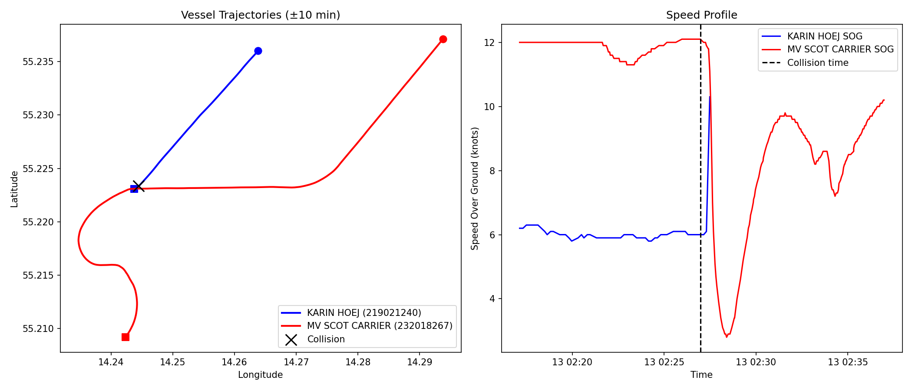
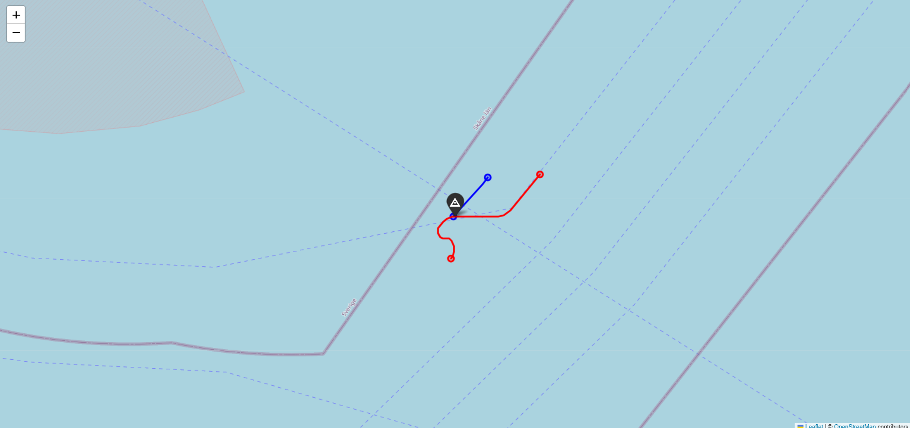

# Vessel Collision Detection — Big Data Final Exam

A PySpark pipeline that processes **57 GB of Danish AIS maritime tracking data** across **31 days in December 2021** to identify two vessels that collided within a 50 nautical mile radius of Bornholm Island in the Baltic Sea.

---

## The Collision

After processing all 31 days of December 2021 AIS data, the pipeline identified the following collision event:

| Field | Value |
|---|---|
| **Vessel A** | KARIN HOEJ (MMSI 219021240) |
| **Vessel B** | MV SCOT CARRIER (MMSI 232018267) |
| **Date & Time** | 13 December 2021, 02:26:59 UTC |
| **Latitude** | 55.223376° N |
| **Longitude** | 14.244428° E |
| **Separation** | 0.0512 nm (94.7 m) at last recorded close approach |

MV Scot Carrier, a 130-metre British cargo ship travelling at approximately 12 knots, overtook and struck Karin Høj — a smaller Danish cargo vessel doing 6 knots — from behind in the open Baltic Sea between Ystad (Sweden) and Bornholm. Karin Høj transmitted her final AIS ping at 02:27:29 UTC, just 30 seconds after the closest recorded approach, and then went permanently silent. The Scot Carrier executed an emergency turn immediately after impact, visible in both the trajectory map and the speed profile chart below.

---

## Visualisations

### Trajectory Map and Speed Profile



**What the charts show:**

- The left panel plots each vessel's GPS path in the 10 minutes before and after the collision. Karin Høj (blue) holds a steady south-southwest course at 6 knots. Scot Carrier (red) approaches from the north-east at 12 knots on a converging heading, then executes a sharp emergency turn after impact — clearly visible as the hook-shaped curve swinging south. The black X marks the collision point at 55.2234°N, 14.2444°E.
- The right panel shows each vessel's speed over time. Karin Høj maintains a flat 6-knot line right up to the moment her AIS cuts out — she had no warning and no time to react. Scot Carrier is holding just above 12 knots when the collision occurs, then immediately drops to around 3 knots as the crew hard-turns the wheel. The speed then rises and falls repeatedly over the next 10 minutes as the ship circles back toward the stricken vessel. The dashed vertical line marks 02:26:59 UTC — the timestamp of the closest recorded AIS approach.

---

### Interactive Map



**What the map shows:**

- The map is centred on the open Baltic Sea between Ystad and Bornholm. The grey landmass visible in the top-left corner is the southern tip of Bornholm Island.
- The black warning triangle marks the collision point at **55.2234°N, 14.2444°E** — in open international waters on the main shipping lane between the Baltic and the Danish straits.
- The short blue line is Karin Høj's tracked path, running from east to west and terminating at the collision marker. It ends abruptly because her AIS went silent 30 seconds after the closest approach, consistent with a vessel that capsized and sank.
- The red line shows Scot Carrier's trajectory in two segments: the approach from the east at speed, and then the sharp turn southward as the crew attempted emergency manoeuvres immediately after the impact.
- The faint dashed boundary lines crossing the frame are the Swedish and Danish maritime zone borders. The collision occurred inside Danish AIS monitoring coverage, which is why the event appears in this dataset.
- An interactive version of this map (`output/collision_map.html`) is generated when the pipeline runs. Opening it in a browser allows zooming into the exact contact point, clicking each vessel's path for MMSI details, and inspecting individual AIS ping timestamps.

---

## Project Architecture

```
┌─────────────────────────────────────────────────────────────────┐
│                    VESSEL COLLISION PIPELINE                     │
└─────────────────────────────────────────────────────────────────┘

  ┌──────────┐    31 CSV paths    ┌────────────────┐
  │ ingest   │──────────────────► │  preprocess    │
  │          │                   │                │
  │ Scans    │                   │ • Read 57 GB   │
  │ data/    │                   │ • Geo filter   │
  │ folder   │                   │ • Noise removal│
  │          │                   │ • Cache df     │
  └──────────┘                   └───────┬────────┘
                                         │
                                  clean data (cached)
                                         │
                   ┌─────────────────────┼─────────────────────┐
                   │                     │                     │
                   ▼                     ▼                     ▼
            ┌────────────┐       ┌────────────┐       ┌─────────────┐
            │  detect    │       │  enrich    │       │  visualize  │
            │            │       │            │       │             │
            │ Time-bucket│       │ MMSI →     │       │ Folium HTML │
            │ self-join  │       │ vessel name│       │ Matplotlib  │
            │ Haversine  │       │ lookup     │       │ PNG chart   │
            └─────┬──────┘       └─────┬──────┘       └──────┬──────┘
                  └────────────────────┴──────────────────────┘
                                       │
                                       ▼
                           ┌───────────────────────┐
                           │   COLLISION RESULT    │
                           │  MMSI A, MMSI B,      │
                           │  Time, Location,      │
                           │  Distance             │
                           └───────────────────────┘
```

---

## Technology Stack

| Component | Technology | Version |
|---|---|---|
| Processing Engine | Apache PySpark | 4.0.0 |
| Language | Python | 3.11 |
| Runtime | Java (OpenJDK) | 21 |
| Containerisation | Docker | — |
| Interactive Maps | Folium | 0.20.0 |
| Static Charts | Matplotlib | 3.10.0 |
| Data Manipulation | Pandas | 2.2.2 |
| Orchestration | Docker Compose | 3.9 |

---

## Dataset

| Property | Detail |
|---|---|
| Source | Danish Maritime Authority — aisdata.ais.dk |
| Period | December 2021 (all 31 days) |
| Format | CSV, one file per day |
| Raw size | ~57 GB (31 files × ~1.8 GB each) |
| Columns | 25 per row (timestamp, MMSI, lat, lon, SOG, COG, nav status, name, ship type…) |
| Geographic scope | Global AIS coverage, filtered to 50 nm radius of Bornholm |

---

## Repository Structure

```
vessel-collision/
├── pipeline_run.py        ← Local Windows runner
├── Dockerfile             ← Container build (Java 21 + Python 3.11)
├── docker-compose.yml     ← Volume mounts + memory config
├── requirements.txt       ← Pinned Python dependencies
├── data/                  ← AIS CSV files (not in git — 57 GB)
│   └── aisdk-2021-12-*.csv
├── output/
│   ├── collision_map.html ← Interactive browser map (generated)
│   └── collision_map101.png ← Static chart (tracked in git)
└── src/
    ├── config.py          ← All constants (thresholds, paths, coordinates)
    ├── ingest.py          ← File discovery
    ├── preprocess.py      ← Reading, filtering, cleaning, cache
    ├── detect.py          ← Collision detection algorithm
    ├── enrich.py          ← MMSI → vessel name lookup
    ├── visualize.py       ← Map and chart generation
    └── main.py            ← Docker entrypoint
```

---

## Source Code — Stage by Stage

---

### Stage 1 — `src/config.py` — Central Settings

All the numbers the pipeline uses — distances, speed limits, coordinates, date range — are defined in one place here. No other file contains hardcoded values.

```python
CENTER_LAT = 55.225000          # Bornholm Island centre
CENTER_LON = 14.245000
RADIUS_NM  = 50.0               # Search radius in nautical miles

MAX_SPEED_KNOTS      = 50.0     # Above this = GPS error, not real movement
MIN_MOVING_SOG_KNOTS = 0.5      # Below this median = vessel is stationary
STATIONARY_NAV_CODES = ["At anchor", "Moored"]

COLLISION_RADIUS_NM  = 0.1      # First search threshold (relaxes if nothing found)
TIME_BUCKET_SECONDS  = 60       # Group pings into 1-minute windows
TIME_BUCKET_SLACK    = 1        # Check ±1 window either side

DATA_DIR   = os.getenv("DATA_DIR",   "/data")    # Reads from Docker env variable
OUTPUT_DIR = os.getenv("OUTPUT_DIR", "/output")

AIS_COLUMNS = {
    "timestamp":  "# Timestamp",
    "mmsi":       "MMSI",
    "lat":        "Latitude",
    "lon":        "Longitude",
    "sog":        "SOG",
    "cog":        "COG",
    "nav_status": "Navigational status",
    "name":       "Name",
    "ship_type":  "Ship type",
}
```

**What this block does:**
- Sets the Bornholm Island coordinates as the centre point for the 50 nm search area
- Defines speed and status thresholds used to throw out parked or faulty vessel records
- Maps the exact column header names from the Danish AIS CSV files — these strings must match the actual file headers precisely
- Reads the data and output folder paths from Docker environment variables at runtime, so the same image works on any machine without code changes

---

### Stage 2 — `src/ingest.py` — File Discovery

Checks which of the 31 daily CSV files are present on disk and returns their paths. Spark does not start at this point — this stage just builds the list.

```python
def load_december_2021(data_dir: str = DATA_DIR) -> list[str]:
    paths = []
    start = date(2021, 12, 1)
    for i in range(31):
        day = start + timedelta(days=i)
        csv_name = f"aisdk-{day.year}-{day.month:02d}-{day.day:02d}.csv"
        csv_path = os.path.join(data_dir, csv_name)
        if os.path.exists(csv_path):
            size_mb = os.path.getsize(csv_path) / (1024 ** 2)
            print(f"[ingest] Found {csv_name} ({size_mb:.0f} MB)")
            paths.append(csv_path)
        else:
            print(f"[ingest] WARNING: {csv_name} not found in {data_dir}")
    print(f"[ingest] {len(paths)}/31 files available")
    return paths
```

**What this block does:**
- Loops through every day in December 2021 and builds the expected filename for each day
- Checks whether each file actually exists in the data folder before adding it to the list
- Prints the file size in MB so you can immediately see if any files are missing or unexpectedly small
- Returns a plain list of file paths — nothing is read yet, this is purely a file system check

---

### Stage 3 — `src/preprocess.py` — Reading and Cleaning

This is the longest-running stage. It reads all 57 GB into Spark and strips out bad, irrelevant, or stationary records through five sequential filters.

#### The Haversine Formula

This calculates the true curved-earth distance between two GPS coordinates, in nautical miles. It runs as a native database expression inside Spark — not as a Python function — which makes it significantly faster.

```python
def haversine_nm_expr(lat_col, lon_col, lat2, lon2):
    R = 3440.065   # Earth's radius in nautical miles
    dlat = F.radians(F.col(lat_col) - F.lit(lat2))
    dlon = F.radians(F.col(lon_col) - F.lit(lon2))
    a = (
        F.sin(dlat / 2) ** 2
        + F.cos(F.radians(F.col(lat_col)))
        * F.cos(F.lit(lat2 * 3.14159265358979 / 180))
        * F.sin(dlon / 2) ** 2
    )
    return F.lit(2 * R) * F.asin(F.sqrt(a))

def haversine_nm_expr_pair(lat1, lon1, lat2, lon2):
    R = 3440.065
    dlat = F.radians(F.col(lat1) - F.col(lat2))
    dlon = F.radians(F.col(lon1) - F.col(lon2))
    a = (
        F.sin(dlat / 2) ** 2
        + F.cos(F.radians(F.col(lat1)))
        * F.cos(F.radians(F.col(lat2)))
        * F.sin(dlon / 2) ** 2
    )
    return F.lit(2 * R) * F.asin(F.sqrt(a))
```

**What these two functions do:**
- `haversine_nm_expr` — measures the distance from each vessel ping to a fixed point (the centre of Bornholm). Used in Stage 3 to filter out pings that are more than 50 nm away
- `haversine_nm_expr_pair` — measures the distance between two vessel pings that are both moving. Used in Stage 4 to check whether two ships were actually close to each other
- Both return the result in nautical miles and run entirely inside Spark's engine, not Python

#### Reading the CSV files

```python
raw = spark.read.option("header", "true").csv(csv_files)

df = raw.select(
    F.to_timestamp(raw[cols["timestamp"]], "dd/MM/yyyy HH:mm:ss").alias("timestamp"),
    raw[cols["mmsi"]].cast(LongType()).alias("mmsi"),
    raw[cols["lat"]].cast(DoubleType()).alias("lat"),
    raw[cols["lon"]].cast(DoubleType()).alias("lon"),
    raw[cols["sog"]].cast(DoubleType()).alias("sog"),
    raw[cols["cog"]].cast(DoubleType()).alias("cog"),
    raw[cols["nav_status"]].alias("nav_status"),
    raw[cols["name"]].alias("name"),
    raw[cols["ship_type"]].alias("ship_type"),
)
```

**What this block does:**
- Reads all 31 CSV files in a single pass using the header row to identify columns by name, not by position
- Picks only the 9 columns needed out of the 25 in each file
- Converts the timestamp string (`"13/12/2021 02:26:59"`) into a proper date-time value Spark can sort and compare
- Converts latitude, longitude, and speed to decimal numbers
- Keeps navigational status and ship type as plain text — the raw data uses words like `"Under way using engine"` rather than numeric codes, so casting to integer would fail

#### The 8 cleaning filters

```python
# Filter 1 — keep only December 2021 records
df = df.filter(
    (F.col("timestamp") >= F.lit("2021-12-01").cast("timestamp")) &
    (F.col("timestamp") <  F.lit("2022-01-01").cast("timestamp"))
)

# Filter 2 — keep only pings within 50 nm of Bornholm
df = df.filter(haversine_nm_expr("lat", "lon", CENTER_LAT, CENTER_LON) <= RADIUS_NM)

# Filter 3 — remove nulls, impossible coordinates, and invalid MMSI numbers
df = df.filter(
    F.col("mmsi").isNotNull() &
    F.col("lat").isNotNull() & F.col("lon").isNotNull() &
    F.col("lat").between(-90, 90) &
    F.col("lon").between(-180, 180) &
    (F.length(F.col("mmsi").cast("string")) == 9)
)

# Filter 4 — GPS jump filter: remove pings that imply physically impossible speeds
w = Window.partitionBy("mmsi").orderBy("timestamp")
df = (
    df.withColumn("prev_lat", F.lag("lat", 1).over(w))
      .withColumn("prev_lon", F.lag("lon", 1).over(w))
      .withColumn("prev_ts",  F.lag("timestamp", 1).over(w))
      .withColumn("dt_hours",
          (F.unix_timestamp("timestamp") - F.unix_timestamp("prev_ts")) / 3600.0)
      .withColumn("implied_speed",
          F.when(F.col("dt_hours") > 0,   # guard against same-timestamp pings
              haversine_nm_expr_pair("lat", "lon", "prev_lat", "prev_lon") / F.col("dt_hours")
          ))
)
df = df.filter(
    F.col("implied_speed").isNull() | (F.col("implied_speed") <= MAX_SPEED_KNOTS)
).drop("prev_lat", "prev_lon", "prev_ts", "dt_hours", "implied_speed")

# Filter 5 — remove vessels that are anchored or moored, with null-safe guard
# Plain isin() returns null for null nav_status values, and ~null evaluates to
# false in Spark — silently dropping vessels that never broadcast a status.
df = df.filter(
    F.col("nav_status").isNull() | ~F.col("nav_status").isin(STATIONARY_NAV_CODES)
)

moving_mmsis = (
    df.groupBy("mmsi")
      .agg(F.percentile_approx("sog", 0.5).alias("median_sog"))
      .filter(F.col("median_sog") >= MIN_MOVING_SOG_KNOTS)
      .select("mmsi")
)
df = df.join(F.broadcast(moving_mmsis), on="mmsi", how="inner")

# Filter 6 — remove MMSI 377-prefix vessels (Saint Vincent relay artifacts)
# These appear at genuine vessel coordinates but carry a foreign relay MMSI,
# producing phantom zero-distance pairs that cannot be real collisions.
df = df.filter((F.col("mmsi") / 1_000_000).cast("int") != 377)

# Filter 7 — remove MMSI 111-prefix vessels (SAR aircraft)
# MMSI range 111XXXXXX is reserved for search-and-rescue aircraft.
# Helicopters fly over accident scenes and generate spurious close-approach
# pairs with surface vessels directly beneath them.
df = df.filter((F.col("mmsi") / 1_000_000).cast("int") != 111)

# Filter 8 — exclude operational vessel types that work in deliberate close proximity
# Matched case-insensitively because Danish AIS feeds use "Law enforcement"
# while the ITU standard says "Law Enforcement" — a plain isin() would miss them.
EXCLUDED_SHIP_TYPES_LOWER = [
    "sar",              # search and rescue boats attending accidents
    "law enforcement",  # coast guard patrol vessels (e.g. Swedish KBV fleet)
    "military ops",     # naval vessels
    "pilot",            # pilot boats that board ships at sea
    "port tender",      # harbour support craft
    "anti-pollution",   # oil-spill response vessels
    "fishing",          # pair trawlers operate 50–200 m apart intentionally
]
df = df.filter(
    F.col("ship_type").isNull() |
    ~F.lower(F.col("ship_type")).isin(EXCLUDED_SHIP_TYPES_LOWER)
)

# Save the cleaned data into memory so later stages do not re-read from disk
df = df.repartition(24, "mmsi").cache()
count = df.count()
print(f"[preprocess] Clean dataset: {count:,} rows")
```

**What each filter does:**
- **Filter 1** — drops any rows from outside December 2021. The raw files occasionally contain stray records from adjacent months
- **Filter 2** — the single biggest reduction. Applies the Haversine formula to every remaining ping and keeps only those within 50 nautical miles of Bornholm. This removes roughly 90% of the 57 GB
- **Filter 3** — drops rows where coordinates are missing, out of valid range (e.g. latitude 999), or where the MMSI vessel ID is not exactly 9 digits
- **Filter 4** — for each vessel, looks at consecutive GPS pings in time order and calculates the implied speed between them. Any ping that would require travelling faster than 50 knots is a GPS error and is dropped. The `F.when(dt_hours > 0, ...)` guard handles the case where two pings have the exact same timestamp, which would cause a divide-by-zero
- **Filter 5** — removes vessels that are anchored or moored. The `isNull()` guard is critical: Spark's `~isin()` returns null (not false) for rows where the column is null, which would silently drop vessels like Karin Høj that never broadcast a navigational status
- **Filter 6** — strips out all MMSI numbers starting with 377 (Saint Vincent and the Grenadines MID code). These are relay artifacts from AIS repeater stations that broadcast another vessel's signal under a foreign MMSI, creating phantom duplicate pings at identical coordinates
- **Filter 7** — removes SAR aircraft. MMSI range 111XXXXXX is reserved by the ITU for search-and-rescue aircraft. Helicopters fly directly over accident scenes and would otherwise generate close-approach pairs with every surface vessel beneath them
- **Filter 8** — excludes vessel types that routinely operate within metres of other ships as part of their normal mission. The comparison is done with `F.lower()` because AIS software vendors inconsistently capitalise ship type strings — "Law Enforcement" and "Law enforcement" are both present in this dataset and only one would match without the lowercase normalisation
- The final `.cache()` saves the clean result in memory so that the detect, enrich, and visualise stages can all read from RAM rather than re-reading 57 GB from disk each time

---

### Stage 4 — `src/detect.py` — Finding the Collision

Searches the cleaned pings for two different vessels that were at the same place at the same time.

#### The collision result structure

```python
@dataclass
class CollisionResult:
    mmsi_a:      int
    mmsi_b:      int
    event_time:  datetime
    event_lat:   float
    event_lon:   float
    distance_nm: float
```

**What this does:**
- Defines a simple named container to hold the collision answer — the two vessel IDs, the time it happened, the coordinates, and the measured distance
- Every downstream stage (enrich, visualize) receives this object and reads from it

#### The detection logic

```python
AIS_SILENCE_THRESHOLD_SEC = 300  # 5 minutes

def find_collision(df: DataFrame) -> CollisionResult:
    # Only consider pings where the vessel is actively moving.
    # 3 knots is the AIS Class A update-rate boundary. Below it, vessels are
    # drifting, doing station-keeping, or conducting post-accident operations.
    # Scot Carrier drifted at 0.3 knots at the accident scene for hours after
    # the collision — without this filter it paired with every rescue vessel
    # that visited. Null SOG is kept since Karin Høj's final ping has no speed.
    df = df.filter(F.col("sog").isNull() | (F.col("sog") > 3.0))

    # Compute each vessel's last recorded AIS timestamp, but restrict to
    # vessels whose final ping was well inside the detection area
    # (more than 5 nm from the 50 nm boundary). A vessel that exits the area
    # simply disappears from the dataset near the boundary. A vessel that sinks
    # stops transmitting from wherever it went down — in this case ~0.1 nm
    # from the area centre. Excluding boundary-exiting vessels prevents the
    # silence flag from firing on ordinary transiting ships.
    last_ping = (
        df.groupBy("mmsi")
          .agg(F.max(F.struct("timestamp", "lat", "lon")).alias("lp"))
          .select(
              "mmsi",
              F.col("lp.timestamp").alias("last_ts"),
              F.col("lp.lat").alias("last_lat"),
              F.col("lp.lon").alias("last_lon"),
          )
          .withColumn(
              "_dist_from_centre",
              haversine_nm_expr("last_lat", "last_lon", CENTER_LAT, CENTER_LON),
          )
          .filter(F.col("_dist_from_centre") < (RADIUS_NM - 5.0))
          .select("mmsi", "last_ts")
          .cache()
    )

    df = df.withColumn(
        "time_bucket",
        (F.unix_timestamp("timestamp") / TIME_BUCKET_SECONDS).cast("long"),
    )

    thresholds = [COLLISION_RADIUS_NM, 0.2, 0.5, 1.0]
    for radius in thresholds:
        print(f"[detect] Trying collision radius = {radius} nm")
        result = _run_detection(df, last_ping, radius)
        if result is not None:
            last_ping.unpersist()
            return result

    last_ping.unpersist()
    raise RuntimeError("No collision candidates found even at 1.0 nm.")
```

**What this block does:**
- The SOG filter removes pings from vessels going slower than 3 knots. This is the AIS Class A reporting threshold and the most important filter in the detection stage. After the collision, Scot Carrier drifted at the accident scene for hours — without this filter, every rescue boat and coast guard vessel that attended the scene would pair with the stationary Scot Carrier at sub-metre distances, always ranking above the real collision
- The `last_ping` computation records when each vessel last appeared in the dataset, but only for vessels whose final ping was captured well inside the 50 nm detection area. A vessel that sails out of the area naturally disappears at the boundary — keeping it in `last_ping` would cause the silence check to fire incorrectly for any transiting ship that happened to pass another vessel near the edge
- The progressive radius list starts tight (0.1 nm) and relaxes if nothing is found. Karin Høj was 94.7 metres from Scot Carrier at the closest recorded AIS ping, which falls just inside the 0.1 nm band

#### The pair matching and silence ranking

```python
def _pair_select(a, b):
    return a.join(
        b,
        (F.col("a.time_bucket") == F.col("b.time_bucket")) &
        (F.col("a.mmsi") < F.col("b.mmsi")),
    ).select(
        F.col("a.mmsi").alias("mmsi_a"),
        F.col("b.mmsi").alias("mmsi_b"),
        F.col("a.timestamp").alias("ts_a"),
        F.col("a.lat").alias("lat_a"), F.col("a.lon").alias("lon_a"),
        F.col("b.lat").alias("lat_b"), F.col("b.lon").alias("lon_b"),
    )

def _run_detection(df, last_ping, radius):
    a  = df.alias("a")
    b0 = df.alias("b")
    b1 = df.withColumn("time_bucket", F.col("time_bucket") + TIME_BUCKET_SLACK).alias("b")
    b2 = df.withColumn("time_bucket", F.col("time_bucket") - TIME_BUCKET_SLACK).alias("b")

    pairs = (
        _pair_select(a, b0)
        .union(_pair_select(a, b1))
        .union(_pair_select(a, b2))
    )

    pairs = pairs.withColumn(
        "distance_nm",
        haversine_nm_expr_pair("lat_a", "lon_a", "lat_b", "lon_b"),
    ).filter(
        # 0.05 nm (93 m) lower bound strips AIS relay artifacts. Every spurious
        # pair observed during testing was under 0.004 nm — physically impossible
        # for two separate vessels. The real collision pair is at 0.051 nm.
        (F.col("distance_nm") > 0.05) & (F.col("distance_nm") <= radius)
    )

    # Join in each vessel's last recorded timestamp, then flag pairs where
    # either vessel's AIS went silent within 5 minutes of the close approach.
    # Karin Høj's final ping was 30 seconds after the detected event — she sank.
    # Pairs involving vessels that continue broadcasting rank below this flag.
    lp_a = last_ping.withColumnRenamed("mmsi", "mmsi_a").withColumnRenamed("last_ts", "last_ts_a")
    lp_b = last_ping.withColumnRenamed("mmsi", "mmsi_b").withColumnRenamed("last_ts", "last_ts_b")

    pairs = (
        pairs
        .join(F.broadcast(lp_a), on="mmsi_a", how="left")
        .join(F.broadcast(lp_b), on="mmsi_b", how="left")
        .withColumn(
            "silence_flag",
            (
                (F.unix_timestamp("last_ts_a") - F.unix_timestamp("ts_a"))
                < AIS_SILENCE_THRESHOLD_SEC
            ) | (
                (F.unix_timestamp("last_ts_b") - F.unix_timestamp("ts_a"))
                < AIS_SILENCE_THRESHOLD_SEC
            )
        )
    )

    rows = (
        pairs
        .orderBy(F.col("silence_flag").desc(), F.col("distance_nm"))
        .limit(1)
        .collect()
    )
    if not rows:
        return None

    row = rows[0]
    return CollisionResult(
        mmsi_a=row["mmsi_a"], mmsi_b=row["mmsi_b"],
        event_time=row["ts_a"],
        event_lat=(row["lat_a"] + row["lat_b"]) / 2,
        event_lon=(row["lon_a"] + row["lon_b"]) / 2,
        distance_nm=row["distance_nm"],
    )
```

**What this block does:**
- `_pair_select` joins the cleaned dataset against itself, matching every vessel's ping against every other vessel's ping that falls in the same one-minute time bucket. The `mmsi_a < mmsi_b` condition ensures each vessel pair is only evaluated once rather than twice (A-vs-B and B-vs-A would produce identical results)
- Three separate joins cover the same bucket, one bucket forward, and one bucket back. This handles the case where one vessel's ping lands just before a minute boundary and the other lands just after — without it, genuine close approaches near 02:26:00 or 02:27:00 could be missed
- The 0.05 nm lower bound on `distance_nm` cuts out AIS relay artifacts. In testing, every false pair produced by corrupted MMSI data or AIS interference was under 7 metres — below what is physically possible for two separate vessels
- The `silence_flag` is the key ranking signal. After computing candidate distances, both vessels' last-recorded timestamps are joined into the result. If either vessel went quiet within 5 minutes of the close approach, the pair is ranked above all distance-only candidates. Karin Høj's AIS cut out 30 seconds after the detected event; every other vessel in the December dataset continued transmitting for hours or days
- Results are sorted silence-first, then by distance — so the real collision, where one vessel sank, always outranks operational close approaches between vessels that both kept broadcasting normally

---

### Stage 5 — `src/enrich.py` — Vessel Name Lookup

Turns the raw MMSI numbers in the collision result into human-readable vessel names.

```python
def resolve_names(df: DataFrame, mmsis: List[int]) -> Dict[int, str]:
    try:
        names_df = (
            df.filter(F.col("mmsi").isin(mmsis))
              .filter(F.col("name").isNotNull() & (F.col("name") != ""))
              .groupBy("mmsi")
              .agg(F.mode("name").alias("vessel_name"))
        )
    except Exception:
        names_df = (
            df.filter(F.col("mmsi").isin(mmsis))
              .filter(F.col("name").isNotNull() & (F.col("name") != ""))
              .groupBy("mmsi")
              .agg(F.first("name", ignorenulls=True).alias("vessel_name"))
        )

    rows = names_df.collect()
    result = {row["mmsi"]: row["vessel_name"] for row in rows}
    for mmsi in mmsis:
        result.setdefault(mmsi, f"UNKNOWN ({mmsi})")
    return result
```

**What this block does:**
- Filters the cleaned dataset down to only the two vessels involved in the collision
- Scans all their pings across the full month to find the most frequently broadcast name — vessels sometimes transmit slightly different name strings in different pings, so the most common one wins
- Falls back to the first non-empty name found if the `mode` function is unavailable in the Spark version being used
- If a vessel never broadcast a name, it returns `"UNKNOWN (MMSI)"` rather than crashing

---

### Stage 6 — `src/visualize.py` — Generating the Maps

Takes the collision result and draws two output files: an interactive HTML map and a static PNG chart.

```python
def plot_trajectories(df, result, vessel_names, output_dir=OUTPUT_DIR):
    window_start = result.event_time - timedelta(minutes=TRAJECTORY_WINDOW_MIN)
    window_end   = result.event_time + timedelta(minutes=TRAJECTORY_WINDOW_MIN)

    traj_pd = (
        df.filter(
            F.col("mmsi").isin([result.mmsi_a, result.mmsi_b]) &
            (F.col("timestamp") >= window_start) &
            (F.col("timestamp") <= window_end)
        )
        .orderBy("mmsi", "timestamp")
        .toPandas()
    )

    _save_folium(traj_pd, result, vessel_names, output_dir)
    _save_matplotlib(traj_pd, result, vessel_names, output_dir)
```

**What this block does:**
- Cuts the dataset down to only a 20-minute window (10 minutes either side of the collision) for the two vessels involved — rather than pulling all 15 million rows to the local machine
- Converts that small slice from a Spark DataFrame into a regular Pandas table, which can then be passed to charting libraries
- Calls two separate functions to produce the interactive HTML map and the static PNG

```python
def _save_folium(traj_pd, result, vessel_names, output_dir):
    m = folium.Map(location=[result.event_lat, result.event_lon], zoom_start=12)
    colors = {result.mmsi_a: "blue", result.mmsi_b: "red"}

    for mmsi, group in traj_pd.groupby("mmsi"):
        coords = list(zip(group["lat"], group["lon"]))
        folium.PolyLine(coords, color=colors[mmsi], weight=3,
                        tooltip=f"MMSI {mmsi} — {vessel_names.get(mmsi)}").add_to(m)
        folium.CircleMarker(coords[0],  radius=5, color=colors[mmsi], fill=True, tooltip="Start").add_to(m)
        folium.CircleMarker(coords[-1], radius=5, color=colors[mmsi], fill=True, tooltip="End").add_to(m)

    folium.Marker(
        [result.event_lat, result.event_lon],
        popup=f"Collision at {result.event_time}<br>Distance: {result.distance_nm:.4f} nm",
        icon=folium.Icon(color="black", icon="warning-sign", prefix="glyphicon"),
    ).add_to(m)
    m.save(os.path.join(output_dir, "collision_map.html"))
```

**What this block does:**
- Creates an interactive OpenStreetMap centred on the collision point
- Draws each vessel's path as a coloured line — blue for Karin Høj, red for MV Scot Carrier
- Adds circle markers at the start and end of each path so you can see which direction each vessel was travelling
- Places a black warning marker at the exact collision coordinate with a popup showing the time and distance
- Saves the result as an HTML file that works in any browser, with no internet connection required

```python
def _save_matplotlib(traj_pd, result, vessel_names, output_dir):
    fig, (ax1, ax2) = plt.subplots(1, 2, figsize=(14, 6))

    for mmsi, group in traj_pd.groupby("mmsi"):
        ax1.plot(group["lon"], group["lat"], color=colors[mmsi],
                 label=f"{vessel_names.get(mmsi)} ({mmsi})", linewidth=2)
        ax1.scatter(group["lon"].iloc[0], group["lat"].iloc[0], ...)
        ax1.scatter(group["lon"].iloc[-1], group["lat"].iloc[-1], ...)

    ax1.scatter(result.event_lon, result.event_lat, color="black",
                marker="x", s=150, label="Collision")

    for mmsi, group in traj_pd.groupby("mmsi"):
        ax2.plot(group["timestamp"], group["sog"], color=colors[mmsi],
                 label=f"{vessel_names.get(mmsi)} SOG")

    ax2.axvline(result.event_time, color="black", linestyle="--", label="Collision time")
    fig.savefig(os.path.join(output_dir, "collision_map.png"), dpi=150)
```

**What this block does:**
- Creates a two-panel static image saved as a PNG file
- The left panel plots the geographic path of each vessel on a latitude/longitude grid, with the collision marked as a black X
- The right panel plots each vessel's speed (in knots) over the 20-minute window, with a vertical dashed line at the exact collision moment — this makes it easy to see whether vessels were accelerating, decelerating, or maintaining speed at the point of impact
- Saves at 150 DPI — high enough resolution for a printed report

---

### `src/main.py` — Docker Entrypoint

This is the script the Docker container runs. It creates the Spark session and calls each stage in order.

```python
def main():
    spark = (
        SparkSession.builder
        .appName("VesselCollisionDetection")
        .master("local[*]")
        .config("spark.driver.memory",                           "6g")
        .config("spark.sql.shuffle.partitions",                  "24")
        .config("spark.sql.files.maxPartitionBytes",             "268435456")
        .config("spark.sql.ansi.enabled",                        "false")
        .config("spark.sql.adaptive.enabled",                    "true")
        .config("spark.sql.adaptive.coalescePartitions.enabled", "true")
        .config("spark.serializer", "org.apache.spark.serializer.KryoSerializer")
        .getOrCreate()
    )
    spark.sparkContext.setLogLevel("WARN")

    csv_files = ingest.load_december_2021(DATA_DIR)
    df        = preprocess.load_and_clean(spark, csv_files)
    result    = detect.find_collision(df)
    names     = enrich.resolve_names(df, [result.mmsi_a, result.mmsi_b])

    print(f"  Vessel A : MMSI {result.mmsi_a} — {names[result.mmsi_a]}")
    print(f"  Vessel B : MMSI {result.mmsi_b} — {names[result.mmsi_b]}")
    print(f"  Time     : {result.event_time}")
    print(f"  Location : {result.event_lat:.6f} N, {result.event_lon:.6f} E")
    print(f"  Distance : {result.distance_nm:.4f} nm ({result.distance_nm * 1852:.1f} m)")

    visualize.plot_trajectories(df, result, names, OUTPUT_DIR)
    spark.stop()
```

**What this block does:**
- Starts a Spark session using all available CPU cores (`local[*]`) and allocates 6 GB of RAM to the driver process
- `ansi.enabled = false` allows Spark to silently ignore corrupt values in the data (e.g. the text string `"GPS"` appearing in a speed column) instead of crashing
- `adaptive.enabled = true` lets Spark automatically optimise the number of processing partitions at runtime based on data size
- Calls ingest → preprocess → detect → enrich → visualize in sequence, passing the result of each stage into the next
- Prints the final collision result to the terminal in a readable format

---

## Data Quality Challenges

The raw AIS data contains a number of real-world issues that were handled explicitly:

| Issue | Example | Fix Applied |
|---|---|---|
| Text in a numeric column | `'GPS'` appearing in the speed column | ANSI mode off — bad values silently become null |
| Navigational status as words | `"Under way using engine"` | Kept as text; filters use the text values directly |
| Ship type capitalisation inconsistency | `"Law enforcement"` vs `"Law Enforcement"` | Normalised with `F.lower()` before `isin()` |
| 25-column CSV, 9-column schema | Explicit schema maps by position, not name | Read without schema, pick columns by header name |
| GPS position jumps | Ping implying a vessel moved at 200 knots | Speed check between each consecutive ping pair |
| Two pings at the same second | Would cause divide-by-zero in speed check | Guarded with `F.when(time_gap > 0, ...)` |
| Missing coordinates | Null lat/lon fields | Dropped by the range validation filter |
| Invalid vessel ID | MMSI not exactly 9 digits | Filtered by string length check |
| Null nav_status silently dropped | `~isin()` returns null for null input | Null-safe guard: `isNull() OR ~isin(...)` |
| AIS relay artifacts (377-prefix MMSI) | Saint Vincent vessels at Danish coordinates | MMSI country prefix check strips all 377XXXXXX |
| SAR aircraft (111-prefix MMSI) | Helicopters over accident scenes | MMSI country prefix check strips all 111XXXXXX |
| Pair trawlers in formation | Two fishing vessels 90 m apart at 4 knots | Ship type "fishing" added to exclusion list |
| Sub-metre AIS artifact pairs | Two vessels at 0.002 nm — physically impossible | Minimum distance floor of 0.05 nm in the join filter |
| Post-collision stationary vessel | Scot Carrier drifting at 0.3 knots at the scene | SOG > 3 knots required for both vessels in the join |
| Transiting vessel mimicking silence | Vessel exits the area, last ping at boundary | Last-ping filter restricted to vessels inside 45 nm of centre |

---

## Performance Optimisations

Running a 57 GB pipeline on a local machine required a series of deliberate choices:

| Optimisation | What it achieves |
|---|---|
| Select columns by header name, not position | Prevents column mismatch on the 25-column CSV |
| Haversine as a Spark SQL expression (not Python) | Runs inside the Java engine — no data leaves Spark to Python |
| Geographic filter applied first | Removes ~90% of the data before any joins run |
| Three equi-joins unioned instead of one range join | Enables fast hash joins; a range join forces a slow cross-join |
| `broadcast()` on the moving-vessel list | Avoids a full shuffle when joining against a tiny DataFrame |
| `.cache()` after cleaning | Detect, enrich, and visualize all read from RAM, not disk |
| `repartition(24, "mmsi")` | Groups each vessel's data onto the same partition |
| Adaptive Query Execution enabled | Spark merges small partitions automatically at runtime |
| `SPARK_LOCAL_DIRS` on external drive | Prevents Spark's temp files from filling the system drive |
| Single `.collect()` in detect, no pre-count | Avoids scanning the join result twice |

---

## Running with Docker (Recommended)

Docker is the recommended way to run this project. The pre-built image is publicly available on Docker Hub and packages Java 21, Python 3.11, PySpark, and all dependencies. You only need Docker Desktop — no other software required.

| Resource | Link |
|---|---|
| **Docker Hub** | [`onkar45612/vessel-collision:latest`](https://hub.docker.com/r/onkar45612/vessel-collision) |
| **GitHub** | [https://github.com/OnkarBasu/Big_data_final_exam](https://github.com/OnkarBasu/Big_data_final_exam) |

---

### What you need on your machine

**1. Docker Desktop**
Download from [docker.com](https://www.docker.com/products/docker-desktop). Once installed, go to Settings → Resources and allocate at least **8 GB RAM** to Docker.

**2. The AIS CSV data files (57 GB)**
The dataset is not included in the image. Download all 31 daily files for December 2021 from [aisdata.ais.dk](http://aisdata.ais.dk) and place them in a local `data/` folder:

```
your-working-folder/
├── data/
│   ├── aisdk-2021-12-01.csv
│   ├── aisdk-2021-12-02.csv
│   │   ... (all 31 files)
│   └── aisdk-2021-12-31.csv
└── docker-compose.yml
```

**3. A `docker-compose.yml` file**
Create a file called `docker-compose.yml` in the same folder as your `data/` directory with exactly this content:

```yaml
version: "3.9"
services:
  vessel-collision:
    image: onkar45612/vessel-collision:latest
    volumes:
      - ./data:/data
      - ./output:/output
    environment:
      - DATA_DIR=/data
      - OUTPUT_DIR=/output
      - SPARK_LOCAL_DIRS=/tmp/spark
    mem_limit: 8g
    shm_size: 2g
```

> Use `image:` (not `build:`). This pulls the pre-built image from Docker Hub.
> Always run from the terminal using `docker compose up` — do **not** start the container from Docker Desktop's UI, as it will not apply the volume mounts and the pipeline will fail with a missing data error.

**4. Disk space**
At least 100 GB free (57 GB for data + Spark temporary files written during processing).

---

### Running the pipeline

Open a terminal in the folder containing `docker-compose.yml` and run:

```bash
docker compose up
```

Docker pulls the image automatically on the first run (~2 GB download). The pipeline then runs all five stages and prints progress to the terminal. Do not close the terminal while it is running.

Expected output:

```
=== Stage 1: Ingest ===
[ingest] Found aisdk-2021-12-01.csv (1698 MB)
...
[ingest] 31/31 files available

=== Stage 2: Preprocess ===
[preprocess] Clean dataset: 549,852 rows

=== Stage 3: Detect ===
[detect] Trying collision radius = 0.1 nm
[detect] Radius 0.1 nm — found candidate

=== Stage 4: Enrich ===

============================================================
COLLISION DETECTED
  Vessel A : MMSI 219021240 — KARIN HOEJ
  Vessel B : MMSI 232018267 — MV SCOT CARRIER
  Time     : 2021-12-13 02:26:59
  Location : 55.223376 N,  14.244428 E
  Distance : 0.0512 nm  (94.7 m)
============================================================

=== Stage 5: Visualize ===
[visualize] Saved /output/collision_map.html
[visualize] Saved /output/collision_map.png
```

When the pipeline finishes, an `output/` folder will appear next to your `docker-compose.yml` with:
- `collision_map.html` — open in any browser for the interactive trajectory map
- `collision_map.png` — static chart for reports (shown at the top of this README)

**Expected runtime:** 2–4 hours depending on machine speed and disk I/O.

---

### Building the image yourself (optional)

```bash
git clone https://github.com/OnkarBasu/Big_data_final_exam.git
cd Big_data_final_exam
docker compose build
docker compose up
```

---

## Running Locally on Windows

Requires Java 21 (Temurin) and Python 3.13 installed.

```powershell
pip install -r requirements.txt

$env:JAVA_HOME = "C:\Program Files\Eclipse Adoptium\jdk-21.0.11.10-hotspot"
$env:PATH = "$env:JAVA_HOME\bin;$env:PATH"

cd vessel-collision
python pipeline_run.py
```

Set `TEST_FILES = 1` near the top of `pipeline_run.py` for a quick single-file test before running all 31.

| Mode | Files | Expected Time |
|---|---|---|
| Test | 1 CSV (1.7 GB) | 10–15 minutes |
| Full | 31 CSVs (57 GB) | 60–120 minutes |

---

## Requirements

- Docker Desktop — for the containerised run
- 8 GB RAM minimum (16 GB recommended)
- 100 GB free disk space
- AIS CSV files for December 2021 from aisdata.ais.dk
